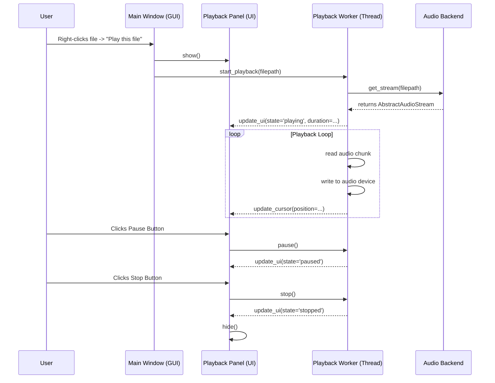

# Audio Subsystem Design

## 1. Overview

This document outlines the design for the Audio Subsystem, which is responsible for reading and decoding various audio file formats into a standardized, streamable format. This unified interface will serve as the foundation for audio playback, analysis, and processing within the application.

The primary goal is to abstract the complexities of different audio codecs (e.g., MP3, FLAC, WAV) behind a simple and consistent API, allowing other components to consume audio data without needing to know the underlying file format.

## 2. Core Requirements

*   **Format Agnostic**: The system must support decoding of common audio formats, starting with WAV, MP3, and FLAC.
*   **Streaming Interface**: It must provide a stream-like interface, offering methods like `read()`, `seek()`, and `close()`. This is crucial for handling large audio files efficiently without loading the entire file into memory.
*   **Metadata Access**: The interface should expose essential audio properties, such as `samplerate`, `number of channels`, and `sample width`.
*   **Extensibility**: The design should be modular, allowing for the addition of new audio decoders in the future with minimal changes to the core system.
*   **Performance**: The decoding process should be efficient to support real-time playback and fast offline analysis.

## 3. Proposed Library: `miniaudio`

After evaluating several libraries, `miniaudio` has been selected as the foundational decoding engine.

### Rationale:

*   **High Performance**: It is a Python wrapper around the highly optimized `miniaudio` C library, ensuring efficient, low-latency audio processing.
*   **Built-in Decoders**: It includes built-in support for our target formats (WAV, FLAC, MP3), eliminating the need for multiple format-specific libraries.
*   **Simple API**: Its API is clean and provides a generator-based approach for streaming audio frames, which maps well to our desired interface.
*   **Cross-Platform**: It is designed to be cross-platform, which aligns with the portability goals of the main application.
*   **No External Dependencies**: `miniaudio` is self-contained and does not require external dependencies like FFmpeg or GStreamer, simplifying installation and deployment.

## 4. System Architecture

The subsystem will be built around three main components: an `AudioStreamProvider` factory, an abstract `AbstractAudioStream` base class, and a concrete `MiniaudioStream` implementation.

```mermaid
classDiagram
    class AudioStreamProvider {
        +get_stream(filepath) AbstractAudioStream
    }

    class AbstractAudioStream {
        <<interface>>
        +read(n_frames) bytes
        +seek(frame_offset) None
        +close() None
        +samplerate : int
        +nchannels : int
        +sample_width : int
    }

    class MiniaudioStream {
        -stream_generator : Generator
        -decoder : miniaudio.StreamableSource
        +read(n_frames) bytes
        +seek(frame_offset) None
        +close() None
    }

    AudioStreamProvider ..> AbstractAudioStream : creates
    AbstractAudioStream <|-- MiniaudioStream```

### 4.1. `AbstractAudioStream`

This abstract base class defines the common interface for all audio streams. It ensures that any component consuming audio data can rely on a consistent set of methods and properties.

**API Specification:**

*   `read(n_frames: int) -> bytes`: Reads a specified number of audio frames and returns them as a byte string.
*   `seek(frame_offset: int) -> None`: Seeks to a specific frame in the audio stream.
*   `close() -> None`: Closes the stream and releases any associated file handles.
*   `samplerate` (property): The sample rate of the audio in Hz.
*   `nchannels` (property): The number of audio channels (1 for mono, 2 for stereo).
*   `sample_width` (property): The number of bytes per sample (e.g., 2 for 16-bit audio).

### 4.2. `MiniaudioStream`

This is the concrete implementation of `AbstractAudioStream` that uses `miniaudio` for decoding.

**Implementation Details:**

*   The constructor will take a file path and initialize a `miniaudio.stream_file()` generator.
*   The `read()` method will pull data from the `miniaudio` stream generator.
*   The `seek()` method will leverage the underlying stream's seek capability.
*   The properties (`samplerate`, `nchannels`, `sample_width`) will be populated from the `miniaudio` decoder instance.

### 4.3. `AudioStreamProvider`

This factory class is the main entry point for the subsystem. It is responsible for creating the appropriate audio stream object for a given file.

**Implementation Details:**

*   It will have a single static method, `get_stream(filepath: str) -> AbstractAudioStream`.
*   Initially, this method will simply instantiate and return a `MiniaudioStream` object.
*   In the future, it could be extended to inspect the file extension or content to select different stream implementations if we decide to support more formats or use other libraries.

## 5. Usage Examples

### 5.1. Playback with PyAudio

This example demonstrates how the new subsystem can replace `wave.open` to play any supported audio format.

```python
import pyaudio
from providers.audio import AudioStreamProvider # Assuming this is where the provider lives

filename = 'myfile.mp3' # or .flac, .wav
chunk_size = 1024

audio_stream = AudioStreamProvider.get_stream(filename)

p = pyaudio.PyAudio()
stream = p.open(format=p.get_format_from_width(audio_stream.sample_width),
                channels=audio_stream.nchannels,
                rate=audio_stream.samplerate,
                output=True)

data = audio_stream.read(chunk_size)
while data:
    stream.write(data)
    data = audio_stream.read(chunk_size)

stream.stop_stream()
stream.close()
p.terminate()
audio_stream.close()
```

### 5.2. Analysis with Librosa

This example shows how the stream can be used with an analysis library. While `librosa` can load files directly, this demonstrates how our streaming interface could be adapted for libraries that can operate on raw audio data buffers.

```python
import numpy as np
import librosa
from providers.audio import AudioStreamProvider

filename = 'myfile.flac'
audio_stream = AudioStreamProvider.get_stream(filename)

# Read the entire file into a buffer for analysis
# Note: For a true streaming analysis, a different approach would be needed,
# but this demonstrates data access.
full_buffer = b''
while True:
    data = audio_stream.read(4096)
    if not data:
        break
    full_buffer += data

# Convert byte buffer to a numpy array for librosa
# The dtype depends on the sample width
if audio_stream.sample_width == 2:
    dtype = np.int16
elif audio_stream.sample_width == 4:
    dtype = np.int32
else:
    raise ValueError("Unsupported sample width")

y = np.frombuffer(full_buffer, dtype=dtype)

# Now you can use librosa for analysis
tempo, beat_frames = librosa.beat.beat_track(y=y.astype(float),
                                             sr=audio_stream.samplerate)

print(f"Estimated tempo: {tempo:.2f} BPM")

audio_stream.close()
```

## 6. Future Enhancements

*   **Additional Format Support**: New `AbstractAudioStream` implementations can be created for other libraries (e.g., `audioread` for formats not covered by `miniaudio`).
*   **Error Handling**: Implement robust error handling for file-not-found, corrupted files, or unsupported formats.

## 7. Audio Frontend Specification

This section details the design for the GUI components that will control audio playback.

Excellent. The todo list has been created. Now, I will provide a detailed breakdown of each step in the plan. This will serve as the specification for the implementation phase.

### Component Interaction Diagram

To clarify how the new components will interact, here is a Mermaid diagram:



---

### 1. Design and Create the Playback Panel UI

*   **Objective:** Create a new Qt Widget (`PlaybackPanel`) that contains all the UI controls for audio playback.
*   **File:** `src/windows/playback_panel.py` (new file)
*   **Class:** `PlaybackPanel(QWidget)`
*   **UI Elements:**
    *   `play_button`: `QPushButton` with "Play" icon/text.
    *   `pause_button`: `QPushButton` with "Pause" icon/text.
    *   `stop_button`: `QPushButton` with "Stop" icon/text.
    *   `filename_label`: `QLabel` to display the name of the currently loaded file.
    *   `playback_slider`: `QSlider` to show and control the playback position.
    *   `time_label`: `QLabel` to display current time / total duration (e.g., "0:15 / 3:45").
*   **Layout:**
    *   Use `QHBoxLayout` and `QVBoxLayout` to arrange the widgets as described in the epic:
        *   A main `QHBoxLayout`.
        *   A `QVBoxLayout` on the left for the buttons (`play_button`, `pause_button`, `stop_button`).
        *   A `QVBoxLayout` on the right.
            *   Top: `filename_label`.
            *   Bottom: A `QHBoxLayout` containing the `playback_slider` and `time_label`.
*   **Signals:** The panel will emit signals when buttons are clicked or the slider is moved by the user.
    *   `play_requested = Signal()`
    *   `pause_requested = Signal()`
    *   `stop_requested = Signal()`
    *   `seek_requested = Signal(int)` (emits frame position)
*   **Slots:** The panel will have public methods (slots) to update its state from the outside.
    *   `update_ui(state: str, filename: str, duration: float)`
    *   `update_playback_position(position: float)`

### 2. Implement the Playback Worker Thread

*   **Objective:** Create a `QObject` that runs in a separate `QThread` to handle audio playback without blocking the GUI.
*   **File:** `src/workers/gui/playback_worker.py` (new file)
*   **Class:** `PlaybackWorker(QObject)`
*   **Core Logic:**
    *   It will use the `AudioStreamProvider` to get an `AbstractAudioStream` for a given file.
    *   It will use `pyaudio` or a similar library to open an audio output stream.
    *   The main work will be done in a `run()` method (or a method called by it) which will contain a loop that:
        1.  Reads a chunk of data from the `AbstractAudioStream`.
        2.  Writes the chunk to the `pyaudio` stream.
        3.  Calculates the current playback position.
        4.  Emits a signal with the new position.
        5.  Checks for state changes (e.g., pause/stop requests).
*   **State Management:** The worker will manage `PLAYING`, `PAUSED`, and `STOPPED` states.
*   **Signals:**
    *   `playback_started = Signal(str, float)` (filename, duration in seconds)
    *   `position_changed = Signal(float)` (current position in seconds)
    *   `playback_finished = Signal()`
    *   `playback_stopped = Signal()`
    *   `error_occurred = Signal(str)`
*   **Slots:**
    *   `start_playback(filepath: str)`
    *   `pause()`
    *   `resume()`
    *   `stop()`
    *   `seek(position_seconds: float)`

### 3. Integrate Panel and Worker into the Main Window

*   **Objective:** Add the `PlaybackPanel` and `PlaybackWorker` to the `MainWindow`.
*   **File:** `src/windows/main_window.py` (modification)
*   **Changes:**
    *   In `MainWindow.__init__`:
        *   Instantiate the `PlaybackPanel` and add it to the main layout (initially hidden).
        *   Instantiate the `PlaybackWorker`.
        *   Create a `QThread`, move the worker to it, and start the thread.
    *   **Connect Signals and Slots:**
        *   Connect `PlaybackPanel` request signals (e.g., `play_requested`) to the `PlaybackWorker`'s action slots (e.g., `resume`).
        *   Connect `PlaybackWorker` update signals (e.g., `position_changed`) to the `PlaybackPanel`'s update slots (e.g., `update_playback_position`).
        *   Connect the main window's need to start playback to the `PlaybackWorker.start_playback` slot.

### 4. Add Menu Actions for Playback Control

*   **Objective:** Allow users to start playback from the context menu and the main "File" menu.
*   **File:** `src/windows/main_window.py` (modification)
*   **Changes:**
    *   **Context Menu:** In the method that creates the context menu for the file view, add a "Play this file" `QAction`.
    *   **File Menu:** Add a "Play this file" `QAction` to the "File" menu.
    *   **View Menu:** Add a toggleable `QAction` "Show Playback Panel" to the "View" menu. This action will control the visibility of the `PlaybackPanel`.
    *   Connect the `triggered` signal of these actions to a new method in `MainWindow`, like `on_play_file_requested()`. This method will get the selected file path and call `playback_worker.start_playback(filepath)`.

### 5. Implement State Management and UI Updates

*   **Objective:** Ensure the UI correctly reflects the playback state (playing, paused, stopped).
*   **Files:** `src/windows/main_window.py`, `src/windows/playback_panel.py`
*   **Logic:**
    *   The `PlaybackPanel` will show/hide the Play/Pause buttons based on the current state.
    *   The `MainWindow` will ensure the `PlaybackPanel` is visible whenever playback is active (`PLAYING` or `PAUSED`).
    *   The "Show Playback Panel" menu item in the "View" menu should be checked if the panel is visible.
    *   The `playback_slider` will be disabled when no file is loaded. Its maximum value will be set based on the file's duration.

### 6. Write Unit Tests for the Playback Worker

*   **Objective:** Ensure the `PlaybackWorker` logic is correct and robust.
*   **File:** `tests/workers/gui/test_playback_worker.py` (new file)
*   **Test Cases:**
    *   Test that `start_playback` correctly opens a stream and emits `playback_started`.
    *   Test that `pause()` and `resume()` correctly change the worker's state.
    *   Test that `stop()` stops playback and cleans up resources.
    *   Test that `seek()` correctly changes the playback position.
    *   Test that `position_changed` is emitted periodically during playback.
    *   Test that `playback_finished` is emitted when the track ends.
    *   (Optional) Mock the audio backend and output device to test the worker in isolation.

---

This detailed plan covers all the requirements from the epic and provides a clear path for implementation.

Are you satisfied with this plan? If so, I can prepare to switch to a different mode to begin implementation.