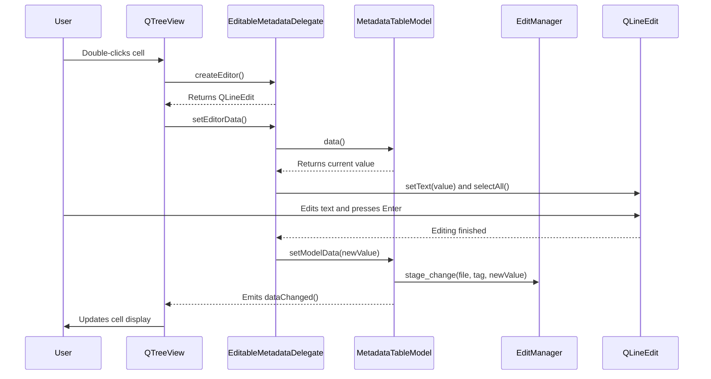

# Technical Specification: Edit-in-Place for File Pane

## 1. Introduction

This document outlines the technical design for an edit-in-place feature in the file pane of the main window. This feature will allow users to double-click a cell to directly edit the metadata of a file.

## 2. Proposed Architecture

The implementation will be centered around a custom `QStyledItemDelegate` that will be responsible for providing the editor widget (a `QLineEdit`) for the `QTreeView` in the main window. The `MetadataTableModel` will be updated to handle the data changes and to identify which columns are editable. The `EditManager` will be used to stage and commit the changes.

### Key Components:

*   **`EditableMetadataDelegate` (New)**: A new `QStyledItemDelegate` subclass that will create a `QLineEdit` as the editor for the table view cells.
*   **`MetadataTableModel` (Modified)**: The existing data model will be modified to:
    *   Indicate that certain cells are editable.
    *   Handle the `setData` operation to update the underlying data and stage changes with the `EditManager`.
*   **`MainWindow` (Modified)**: The main window will be updated to set the new `EditableMetadataDelegate` on the `QTreeView`.
*   **`ColumnSettings` (Modified)**: A new attribute, `is_writable`, will be added to the `ColumnSettings` data class to flag which columns can be edited.

## 3. Component Breakdown

### 3.1. `EditableMetadataDelegate`

A new file will be created at `src/delegates/editable_metadata_delegate.py`. This class will inherit from `QStyledItemDelegate` and implement the following methods:

*   **`createEditor(self, parent, option, index)`**: This method will be called when editing is initiated. It will create a `QLineEdit` widget.
*   **`setEditorData(self, editor, index)`**: This method will set the editor's data to the current value of the cell. The text will be fully selected.
*   **`setModelData(self, editor, model, index)`**: This method will be called when the editor loses focus or the user presses "Enter". It will commit the data from the editor to the model using `model.setData()`.
*   **`updateEditorGeometry(self, editor, option, index)`**: This method will ensure the editor is properly sized and positioned within the cell.

### 3.2. `MetadataTableModel`

The `src/models/qt/metadata_model.py` file will be modified as follows:

*   **`flags(self, index)`**: This method will be overridden to return the appropriate flags for each cell. If a cell is in a writable column, it will add `Qt.ItemIsEditable` to the default flags.
*   **`setData(self, index, value, role)`**: This method will be implemented to handle the data changes. It will:
    1.  Update the internal data representation.
    2.  Get the `MediaFile` object associated with the row.
    3.  Use the `EditManager` to stage the change.
    4.  Emit the `dataChanged` signal.
*   A new method will be added to get the `MediaFile` object for a given row index.

### 3.3. `MainWindow`

The `src/windows/main_window.py` file will be modified to:

1.  Import the new `EditableMetadataDelegate`.
2.  In the `__init__` method, after the `QTreeView` is created, an instance of `EditableMetadataDelegate` will be created and set on the view using `self.files_view.setItemDelegate(self.delegate)`.

### 3.4. `ColumnSettings`

The `src/models/settings.py` file will be modified to add a new attribute to the `ColumnSettings` data class.

The definition will be updated to include `is_writable`:
```python
@dataclass
class ColumnSettings:
    id: str
    label: str
    group: str
    width: int
    is_visible: bool = True
    is_writable: bool = False
```

The `FileListSettings` will be updated to mark the appropriate columns as writable. For example:
```python
ColumnSettings(id=KEY_TITLE, label="Title", group="Tags", width=200, is_writable=True),
```

## 4. Data Flow

The following sequence diagram illustrates the data flow when a user edits a cell:



This design ensures a clean separation of concerns, with the delegate handling the UI aspects of editing, the model managing the data, and the `EditManager` handling the persistence of the changes.