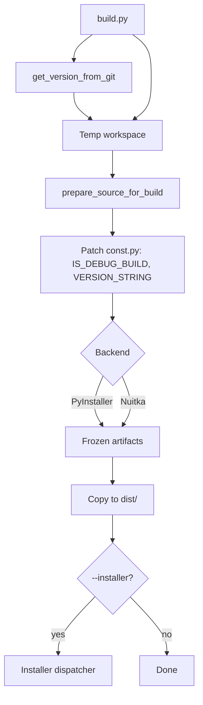

# Packaging and Distribution Design

From the Public Release Readiness epic.

This document describes how YAAMT is built and distributed. It supersedes
the previous cx_freeze-based design.

## Goals

- Produce standalone executables for the CLI (`src/yaamt.py`) and GUI
  (`src/yaamt-gui.py`) on Windows, macOS, and Linux.
- Stamp every artifact with a version derived from the git tag history
  (see `versioning.md`).
- Hand the resulting artifacts off to platform-native installers (see
  `installers.md`).

## Tooling

| Concern              | Tool                          |
|----------------------|-------------------------------|
| Freezing the app     | PyInstaller (default), Nuitka |
| Build orchestration  | `build.py` in the repo root   |
| Version stamping     | `src/util/version.py`         |
| Source patching      | `build.py:prepare_source_for_build` |

`cx_freeze` is no longer used. The build system supports two backends
(PyInstaller and Nuitka) selected via `--build-tool`. Nuitka builds
must respect the constraint that any dependency that cannot be
statically linked is gated behind `debug_only=True` so it is excluded
from release builds (per AGENTS.md).

## Build Flow

1. `build.py` resolves the version string by calling
   `util.version.get_version_from_git()` against the project root.
2. A temporary build workspace is created and the source tree copied in.
3. `prepare_source_for_build` patches `src/util/const.py`:
   - `IS_DEBUG_BUILD` -> `True` or `False` per `--build-mode`
   - `VERSION_STRING` -> the resolved version string
4. The selected backend (PyInstaller / Nuitka) freezes the patched
   source into the temporary workspace.
5. Artifacts are copied back to the project's `dist/` directory.
6. If `--installer` is requested, control passes to the installer
   dispatcher (see `installers.md`).

## Versioning

Version derivation, format, and failure modes are defined in
`versioning.md`. The build system never computes the version itself - it
calls into `util.version` so the running app and the build artifact agree.

## Surfacing the Version

- CLI: `yaamt --version` (`src/yaamt.py:574`) prints `get_version()`.
- GUI: the About window (`src/windows/about_window.py:19`) calls the same
  function.

Both consumers read the patched `const.VERSION_STRING` at runtime when the
app is frozen, and fall back to live `git describe` when run from a source
checkout.

## Diagram

