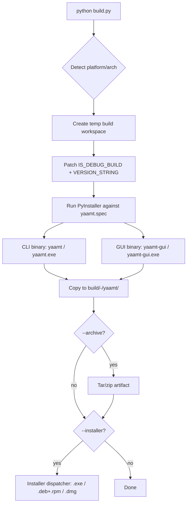

# Packaging and Distribution Design

This document outlines the design for packaging and distributing YAAMT for Windows, macOS, and Linux platforms using **PyInstaller**.

## 1. Objectives

- Generate standalone application binaries for both the CLI (`src/yaamt.py`) and GUI (`src/yaamt-gui.py`).
- Create platform-specific installers from that output via `build.py --installer` (see `installers.md` for per-platform detail):
    - `.exe` (Inno Setup) for Windows
    - `.dmg` for macOS
    - `.deb` / `.rpm` for Linux
- Implement dynamic versioning based on Git tags and revision hashes (see `versioning.md`).
- Display the application version in the CLI and the GUI's "About" window.

## 2. Implementation Plan

### 2.1. PyInstaller spec file

`yaamt.spec` in the project root drives the PyInstaller build. It defines two `Analysis` blocks (one each for the CLI and GUI entrypoints), a shared `excludes` list (test frameworks, alternative packagers, known-unused transitive deps), and a `hiddenimports` list for libraries whose static-import detection PyInstaller misses (notably `scipy.*`).

Driven by `build.py` (the high-level orchestrator), which:
- Detects platform and architecture
- Creates a temporary build workspace by copying only `src/` and `resources/`
- Patches `IS_DEBUG_BUILD` for release builds
- Invokes `pyinstaller yaamt.spec`
- Copies the output to a timestamped directory `build/<mode>-YYYYMMDD-HHMMSS/yaamt/`

### 2.2. Dynamic Versioning

`build.py` resolves the version by calling `util.version.get_version_from_git()` — the same helper the running application uses — and patches the result into `src/util/const.py`'s `VERSION_STRING` constant in the temp build workspace. The runtime application reads that constant directly — no separate `VERSION` file is generated. Version format, derivation, and failure modes are defined in `versioning.md`.

### 2.3. Platform-Specific Output

| Platform | Output |
|---|---|
| Windows | `yaamt.exe`, `yaamt-gui.exe` (one-folder bundle with PySide6 / mutagen / etc) |
| Linux   | `yaamt`, `yaamt-gui` (one-folder bundle) |
| macOS   | `yaamt`, `yaamt-gui` (one-folder bundle) |

Native installers (`.exe` / `.deb` + `.rpm` / `.dmg`) are produced from this output by the installer dispatcher in `build.py`. See `installers.md`.

### 2.4. Displaying the Version in the Application

- **CLI**: `yaamt.py --version` reads `util.const.VERSION_STRING` and prints it.
- **GUI**: `windows/about_window.py` reads the same constant and renders it in the About dialog.

## 3. Build Process

```bash
# Install Python + system build deps
python build.py --install-deps

# Debug build (default)
python build.py

# Release build (excludes debug-only analyzers via IS_DEBUG_BUILD patch)
python build.py --release

# Tar/zip the build for distribution (version defaults to the git-derived
# string; --version-name overrides it)
python build.py --release --archive

# Build a platform-native installer
python build.py --release --installer
```

## 4. Diagram: Build Workflow


