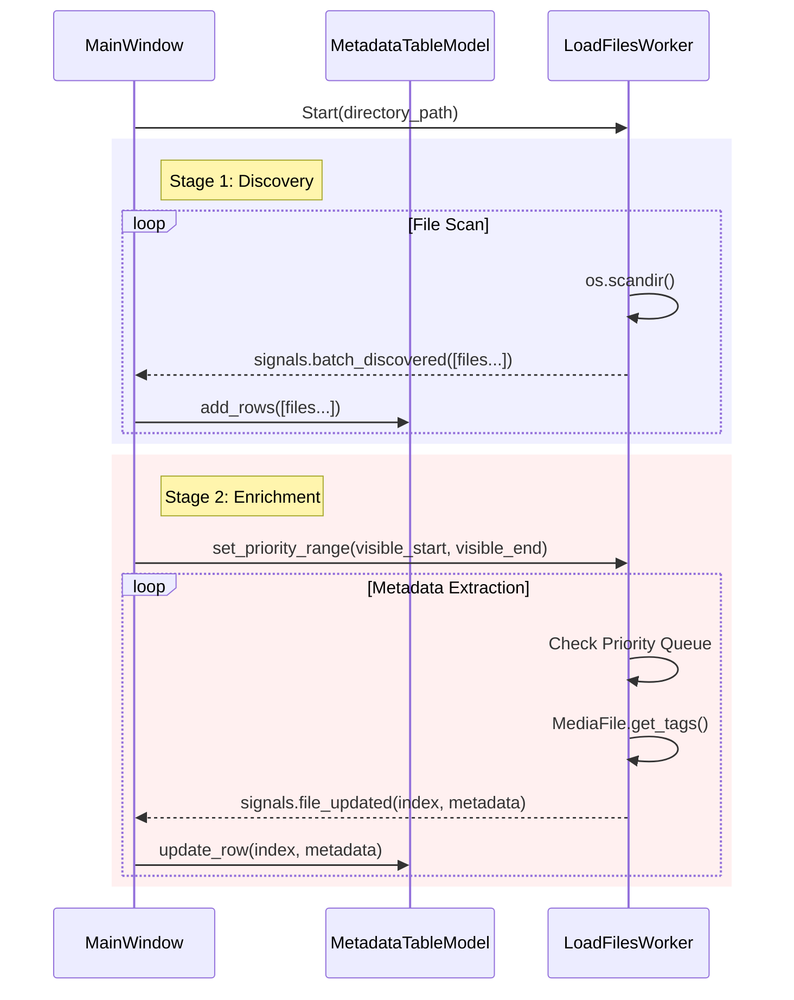

# Seamless File Loading Design

**Epic**: `doc/epics/20251118_Make_File_Loading_More_Seamless.md`

## Problem
Loading large directories (1000+ files) currently blocks the user from seeing any file information until all metadata has been extracted. This results in a poor user experience where the application appears unresponsive or blank for significant periods.

## Goals
1.  **Immediate Feedback**: Display file names and basic filesystem properties (size, date) as fast as the filesystem allows.
2.  **Non-Blocking Metadata**: Load expensive audio metadata (ID3 tags, duration, bitrate) in the background.
3.  **Viewport Prioritization**: Prioritize loading metadata for files currently visible to the user.
4.  **Clear Progress Indication**: Provide distinct visual feedback for the discovery vs. enrichment phases.

## Architecture

### 1. Unified Worker Strategy
We will modify `LoadFilesWorker` to operate in two distinct stages.

*   **Stage 1: Discovery (Fast Scan)**
    *   Utilizes `os.scandir` to rapidly iterate through the directory.
    *   Extracts filesystem-level data: Filename, File Path, Size, Creation Time, Modification Time. (Note: `os.scandir` provides `DirEntry` objects which allow efficient access to stat data without a separate system call on most platforms).
    *   Yields batches of "basic" file data to the UI thread.
    *   This stage is prioritized to ensure the file list and scrollbar are populated quickly.

*   **Stage 2: Enrichment (Metadata Extraction)**
    *   Begins after Stage 1 is complete (or sufficiently populated).
    *   Iterates through the discovered files to load deep metadata (`MediaFile` instantiation).
    *   Yields updates for specific rows as they are processed.
    *   Listens for "priority" signals from the UI to determine which files to process next.

### 2. MetadataTableModel Updates
The `MetadataTableModel` needs to support incremental updates:
*   `add_rows(rows_data)`: Appends new files (from Stage 1) to the model.
*   `update_row(index, metadata)`: Updates an existing row with enriched metadata (from Stage 2).

### 3. Viewport Awareness
The `MainWindow` will monitor the `files_view` (QTreeView) state:
*   Connect to `verticalScrollBar().valueChanged` and `resizeEvent`.
*   Calculate the range of currently visible rows.
*   Send this range to the `LoadFilesWorker` via a thread-safe method (e.g., `set_priority_range(start, end)`).

### 4. UX & Status Updates
The UI will reflect the two stages:
*   **During Stage 1**: Status bar shows "Scanning files... (N found)". Progress bar is in "busy" (indeterminate) mode or hidden, as total count is unknown.
*   **During Stage 2**: Status bar shows "Loading metadata... (N/Total)". Progress bar shows deterministic percentage (0-100%).
*   **Completion**: Status bar shows "Ready. N files loaded."

## Workflow Diagram



## Implementation Details

### LoadFilesWorker
*   **Input**: `directory_path`
*   **Signals**:
    *   `files_discovered(list[dict])`: Emitted during Stage 1.
    *   `file_updated(int, dict)`: Emitted during Stage 2. Contains row index and new data.
    *   `finished()`: Emitted when all files are processed.
*   **Methods**:
    *   `set_priority_range(start: int, end: int)`: Updates the internal processing order.

### Data Structure
The model's internal storage `_data` will be initialized with partial dictionaries in Stage 1:
```python
{
    KEY_FILE_PATH: "...",
    KEY_MAIN_FILENAME: "song.mp3",
    KEY_FILE_SIZE: 1024,
    KEY_TITLE: "Loading...", # Placeholder
    # ...
}
```
In Stage 2, these dictionaries are updated with the full tag data.

## Edge Cases
*   **Directory Change**: If the user changes directories, the current worker is cancelled. The new worker starts fresh.
*   **Sorting**: If the user sorts the view during Stage 2, the `row_index` communicated by the worker might become invalid relative to the view, but remains valid relative to the Model's source data *if* the sort is handled via a Proxy Model.
    *   *Correction*: The Worker should probably track files by `file_path` or a stable ID to ensure updates map correctly, OR the Model handles the mapping.
    *   *Simplification*: The Worker works on the *source* model indices. The View uses a `QSortFilterProxyModel`. The UI must map view coordinates (priority range) to source coordinates before sending to the Worker. The Worker sends source coordinates back.

## Performance Considerations
*   **Batching**: Stage 1 updates should be batched (e.g., every 100 files) to avoid flooding the event loop.
*   **Throttling**: Priority updates from the UI should be debounced (e.g., max once per 100ms) to prevent worker thread contention.