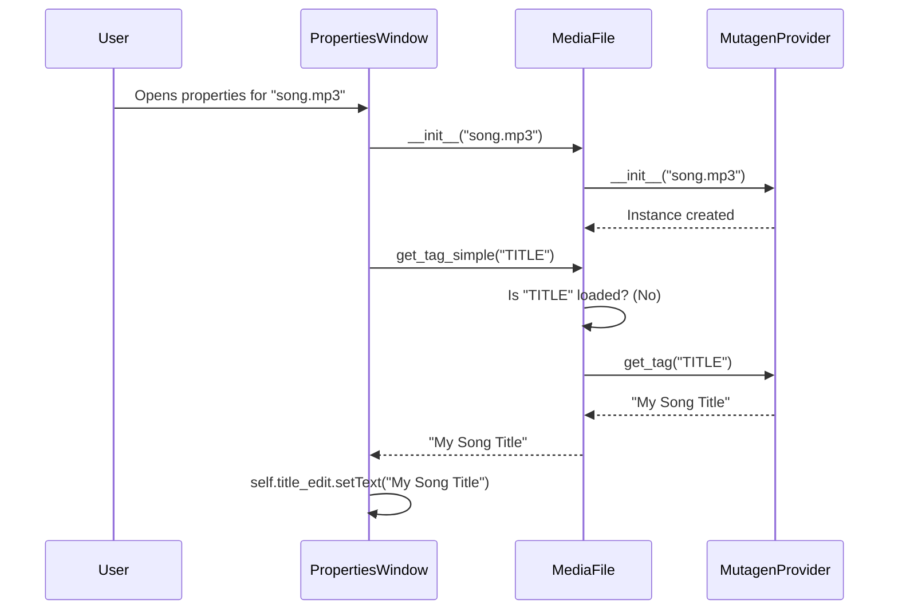
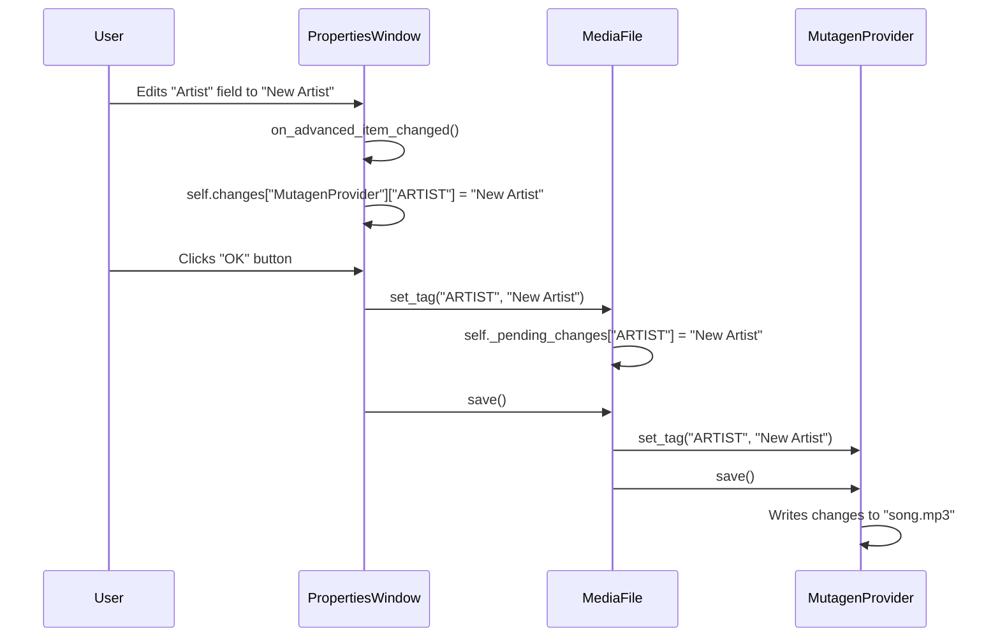

# Properties Window Design Document

## 1. Overview

The `PropertiesWindow` is a QMainWindow-based dialog that provides a detailed view of a single media file's metadata. It is designed to present information in a clear, organized manner and allow for both simple and advanced editing of metadata tags. The window serves as a primary interface for users to interact with the metadata of individual files, separate from the main application window's file browser.

The architecture is intentionally decoupled, separating the user interface (the "View") from the data access and manipulation logic (the "Model"). This separation is crucial for maintainability and scalability.

## 2. Architectural Principles

The design of the `PropertiesWindow` and its components is guided by the following principles:

### a. Model-View Separation

The core of the design is the separation between the `PropertiesWindow` (View) and the `MediaFile` class (Model).

*   **`PropertiesWindow` (View):** Its sole responsibility is to display data provided by the `MediaFile` object and to capture user input. It does not contain any logic for reading from or writing to the actual media file. It is purely a presentation layer.
*   **`MediaFile` (Model):** This class is responsible for all data-related operations. It interfaces with various metadata providers (like Mutagen) to read tags, stream information, and other file properties. It also manages pending changes and handles the logic for saving those changes back to the file.

This separation ensures that changes to the UI do not affect the data logic, and vice-versa.

### b. Provider-Agnostic Data Model

The `MediaFile` class is designed to be a facade for one or more underlying metadata providers. The `PropertiesWindow` is completely unaware of which provider (e.g., `MutagenProvider`, a future `SeratoProvider`) is supplying the data. This abstraction is key to the system's extensibility. It allows new metadata formats and sources to be added without requiring any changes to the UI code.

### c. Lazy Loading of Metadata

To ensure performance and efficiency, the `MediaFile` class does not load all of a file's metadata when it is instantiated. Instead, metadata is loaded on-demand (Just-In-Time). When the `PropertiesWindow` requests a specific tag for display, `MediaFile` checks if it has already loaded that tag. If not, it queries the appropriate provider at that moment. This approach minimizes initial load times and reduces memory consumption, especially when dealing with large libraries or files with extensive metadata.

### d. State Management and Change Tracking

The `PropertiesWindow` implements a clear system for managing user edits.

1.  **Initial State:** The window loads and displays the original, unmodified metadata from the `MediaFile` object.
2.  **Change Detection:** When a user modifies a tag (currently in the "Advanced" tab), the `on_advanced_item_changed` signal is triggered.
3.  **Storing Changes:** The window maintains two dictionaries:
    *   `self.original_values`: Stores the initial value of a tag the first time it is modified. This is used for the "Revert" functionality.
    *   `self.changes`: Stores the new, user-entered value for the tag.
4.  **UI Feedback:** The UI provides immediate feedback for changes: the "OK" button becomes enabled, the "Close" button changes to "Cancel", and the edited field in the advanced view becomes bold.
5.  **Committing Changes:** When the user clicks "OK", the `changes` dictionary is intended to be passed to the `MediaFile` object, which then orchestrates the saving process.

## 3. Component Breakdown

### a. `PropertiesWindow`

*   **Responsibilities:**
    *   Initialize and display the UI, including the tabbed layout.
    *   Instantiate a `MediaFile` object for the given file path.
    *   Populate the UI fields and trees with data from the `MediaFile`'s `metadata` property.
    *   Listen for user edits and update its internal `changes` and `original_values` state.
    *   Manage the enabled/disabled state of control buttons ("OK", "Close").
    *   Provide functionality to revert individual changes.
    *   On user confirmation ("OK"), trigger the save operation on the `MediaFile` instance.

*   **Tab Structure:**
    *   **Basic Info:** A `QFormLayout` for viewing and editing the most common metadata tags (Title, Artist, Album, etc.).
    *   **Details:** A read-only `QTreeWidget` that displays technical information about the file (`KEY_INTERNAL`) and the audio stream (`KEY_STREAM_INFO`). This data is not meant to be edited by the user.
    *   **Advanced:** A `QTreeWidget` that provides a raw view of all available tags, grouped by their metadata provider. This view allows direct editing of any writable tag value.

### b. `MediaFile`

*   **Responsibilities:**
    *   Identify and load the correct `MetadataProvider` for a given file.
    *   Provide a single, unified interface (`get_tag_simple`, `get_stream_info_value`, etc.) for the UI to access metadata, abstracting away the provider-specific details.
    *   Assemble a comprehensive dictionary of all metadata upon request via the `metadata` property.
    *   Accept and track pending changes to tag values (`set_tag`).
    *   Orchestrate the saving of pending changes back to the file using the appropriate provider (`save`).

## 4. Data Flow

### a. Loading Data



### b. Saving Data



## 5. Future Development Guidelines

### a. Adding a New Field to the "Basic Info" Tab

1.  **`PropertiesWindow`:** Add a new `QLineEdit` (or other appropriate widget) in `setup_basic_info_tab`.
2.  **`PropertiesWindow`:** Populate the new widget with data using `self.media_file.get_tag_simple(KEY_NEW_TAG)`.
3.  **`PropertiesWindow`:** Connect the widget's `textChanged` signal to a new handler function.
4.  **Handler Function:** In the new handler, update `self.changes` with the new value from the widget. This will enable the "OK" button.
5.  **`const.py`:** Ensure the `KEY_NEW_TAG` constant is defined.
6.  **`MediaFile`:** When `on_ok_clicked` is called, the change will be passed to `media_file.set_tag` and saved.

### b. Completing the Save Functionality

The `on_ok_clicked` method in `PropertiesWindow` is incomplete. It should be updated to call the `MediaFile`'s `set_tag` and `save` methods.

**Example Implementation:**

```python
# In PropertiesWindow.on_ok_clicked

def on_ok_clicked(self):
    self.setEnabled(False)

    status_label = QLabel("Writing changes...")
    self.bottom_layout.insertWidget(1, status_label)

    try:
        # This assumes changes are captured in a compatible format.
        # The current format of self.changes needs to be mapped to set_tag calls.
        for provider_name, tags in self.changes.items():
            for tag_name, new_value in tags.items():
                self.media_file.set_tag(tag_name, new_value)
        
        self.media_file.save()

    except Exception as e:
        # Handle potential write errors, show a message box to the user
        print(f"Error saving changes: {e}") # Replace with proper error dialog
    finally:
        self.close()
```

### c. Integrating a New Metadata Provider

1.  **Create Provider:** Create a new class in `src/providers/metadata/` that inherits from `MetadataProviderBase` (assuming one exists or is created).
2.  **Implement Methods:** Implement the required methods, such as `is_readable`, `get_tag`, `set_tag`, and `save`.
3.  **`MediaFile`:** In `_get_providers_for_file`, add the new provider class to the `potential_providers` list. The `MediaFile` class will automatically detect and use it for compatible files. The provider-agnostic design means no changes are needed in `PropertiesWindow`.